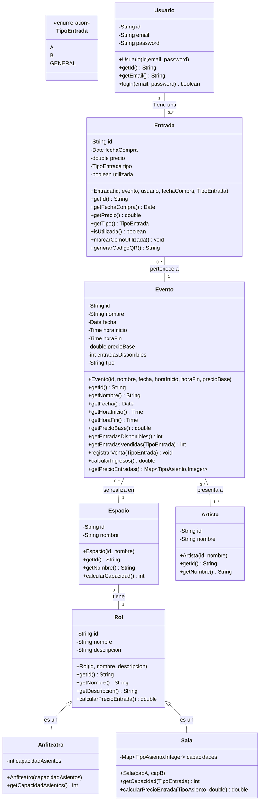

# Diagrama de Clases

Este es el diagrama de clases del proyecto:

no hago un modelo de datos ya que voy a usar un ORM

las tecnologias que voy a usar es:
 .NET 8, Aplicacion web blazor, sql server, Entity Framework y para el testeo xUnit 

______
Alcance del Testeo
    Cobertura Funcional:
        Se testearán únicamente los métodos públicos de cada clase, ignorando implementaciones internas.
    Casos de Prueba Cubiertos (Caja Negra):
        Validaciones de entradas válidas e inválidas.
        Resultados esperados frente a diferentes combinaciones de datos     de entrada.
    Exclusiones del Testeo:
        Implementaciones internas no accesibles desde la API pública de las clases.
        Aspectos relacionados con la interfaz de usuario (UI) y la integración con bases de datos (cubierto por tests de integración en otros enfoques).
Prioridades
    Alta Prioridad: Usuario, Entrada, Evento.
    Media Prioridad: Espacio, Rol, Sala.
