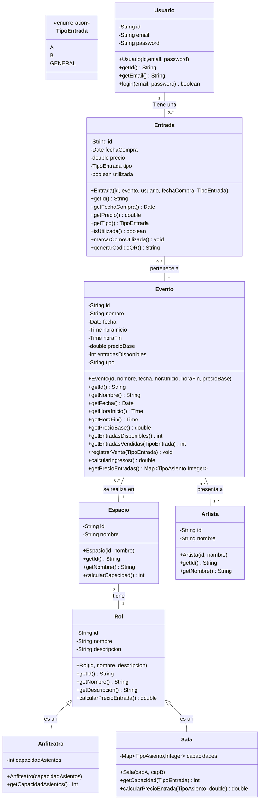

# Diagrama de Clases

Este es el diagrama de clases del proyecto:

----------
## Modelo de Datos

No se realiza un modelo de datos manual ya que se utilizará un **ORM (Entity Framework)** para la gestión de la base de datos.

----------
## Tecnologías Utilizadas

- **.NET 8**
- **Aplicación Web Blazor**
- **SQL Server**
- **Entity Framework** (ORM)
- **xUnit** (para testing unitario)

----------
## Alcance del Testeo Unitario

### Cobertura Funcional
- Se testearán únicamente los **métodos públicos** de cada clase, ignorando implementaciones internas.

### Casos de Prueba Cubiertos (Caja Negra)
- Validaciones de **entradas válidas** e **inválidas**.
- Resultados esperados frente a diferentes combinaciones de **datos de entrada**.

### Exclusiones del Testeo
- Implementaciones internas no accesibles desde la API pública de las clases.
- Aspectos relacionados con:
  - La **interfaz de usuario (UI)**.
  - La **integración con bases de datos** (estos serán abordados mediante tests de integración en otros enfoques).

> 🔹 **Nota:** El alcance de este documento se limita exclusivamente a **tests unitarios**.

## Prioridades

- **Alta Prioridad**: Usuario, Entrada, Evento.
- **Media Prioridad**: Espacio, Rol, Sala.
----------
## Justificación de la Elección de Tecnología y Consideraciones

- Utilizaré **.NET 8** y una **Aplicación Web Blazor**, ya que en la empresa donde trabajo se utiliza este stack y deseo capacitarme en el mismo.

- Emplearé **Entity Framework** como ORM, dado que facilita la creación de aplicaciones al:
  - Simplificar la manipulación de datos.
  - Proporcionar una capa de seguridad adicional contra **inyecciones SQL**, ya que maneja internamente la mayoría de los patrones de inyección conocidos.

- Para las pruebas unitarias, usaré **xUnit**, ya que es la herramienta de testeo más popular en el ecosistema .NET.
  - Cuenta con una **gran comunidad** de soporte.
  - Es una herramienta **madura y bien testeada**, lo que garantiza confiabilidad y facilidad de aprendizaje.

